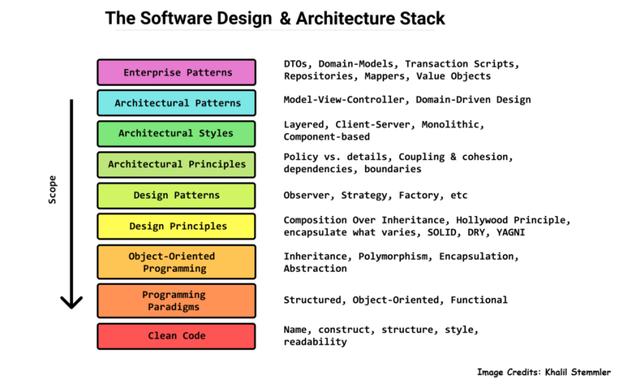

## The Patterns You Do Not Notice Until You Actually Build Something

When I first started learning how to code, I thought writing software was just about getting things to work. If a page loaded and a button clicked, I felt like I was set. But when I began building bigger projects, especially my final project for this class, I started to notice something. There is a whole layer of structure underneath real applications. Developers call these design patterns, but to me they feel more like the habits that naturally show up when you try to keep your project from turning into a mess.

Design patterns are not strict rules or copy and paste templates. They are ideas that help guide the way a system should be organized so it does not fall apart as it grows. When your project is tiny, you might not think about them at all. But once you add more pages, more data, and more interactions, these patterns begin to appear whether you planned them or not.

In my final project, I realized I had been using a few design patterns without even naming them. The first was similar to the Singleton pattern. Since Prisma creates one shared database client, the entire app uses a single instance instead of making new connections everywhere. This keeps things fast and prevents random database errors. I did not intentionally apply a pattern here, but the behavior matched exactly how a Singleton works.

Another pattern showed up in my front end. Everything was built as reusable components. This is the Component pattern. I created a navbar component, card components, contact display components, and form components. Instead of rewriting the same structure in multiple files, I wrote something once and used it wherever I needed it. It kept the UI consistent and made updates easier.

I also separated the logic for user actions into server actions that handled the actual work. The UI triggered the action, but the server function decided how it happened. This setup is similar to the Controller pattern. By splitting the responsibility, the code stayed organized and much easier to debug.

By the end of the project, I understood design patterns in a way that felt real. They are not just interview terms. They are the solutions that naturally appear when a project becomes complicated enough to need them. If someone asked me now what design patterns are, I would say they are proven ways to structure your code so it scales without breaking. And if they asked which ones I used, I would point to my Singleton style database client, my Component based UI, and my Controller style server logic.

These patterns made my final project feel structured instead of chaotic. They showed me that good architecture is not something you add at the end. It grows with the project as you learn how to organize things in a cleaner and more reliable way.
