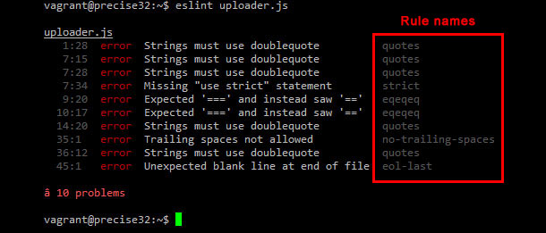

## First Impressions
When I first started running into ESLint errors in VSCode, I honestly thought they were just nitpicks. Why should it matter if I used double quotes instead of single quotes, or where I placed a curly brace? At first, it felt like a never-ending stream of red lines that slowed me down instead of helping me code faster. But over time, I realized that the “rules” were doing more than keeping things tidy—they were teaching me.

## Painful but Useful
There were moments in the WODs where getting rid of ESLint errors was frustrating. I’d fix one thing, only to see five more pop up. It was easy to feel like it was just busywork. But then I started noticing something: the errors weren’t random. They were pointing out real issues. For example, switching from `var` to `let` or `const` actually made my code safer. Single quotes weren’t just for style—they kept everything consistent and easier to read. The pain of fixing those errors slowly turned into the practice of writing cleaner code the first time.

## Standards as Training Wheels
What changed my perspective is seeing coding standards as training wheels. They keep me from drifting into sloppy habits, and they push me toward thinking like a programmer who’s writing for a team instead of just for myself. Coding standards aren’t just about making the code look nice. They’re about communication—making sure future readers (including me) don’t have to waste time figuring out what I meant. In that sense, I think coding standards are one of the most practical ways to improve quality.

## Final Thoughts
I still have a love-hate relationship with ESLint, but I can’t deny it’s made me better. At first it felt painful, but now it feels like guardrails that make sure I stay consistent. If nothing else, I’ve learned that the details matter. Standards aren’t just “rules.” They’re part of how we grow into writing code that’s professional, readable, and reliable.
