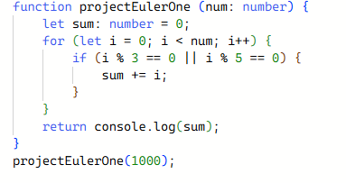

## Getting started with Typescript

Coming from C, C++, and Java, learning Typescript has been pretty smooth but still new enough to keep me on my toes. The syntax feels familiar, but what I really like is how it catches a lot of errors before I even run the code. It feels a bit like having the best parts of Java or C++ but without all the extra overhead. At the same time, it’s still quick to test and experiment like regular JavaScript, which makes it easier to try things out.

## Why I Think It’s Useful

From a software engineering point of view, Typescript feels like a good middle ground between just hacking something together and writing really solid code. Having types and interfaces makes me think a little harder about what data I’m passing around, which I know will save headaches later. It’s also nice that other people could look at my code and quickly see what’s going on just by reading the function definitions.

## Athletic Software Engineering

The practice WODs were definitely stressful at first. Being timed while trying to code made me mess up simple things early on, but doing them over and over actually helped a lot. It’s kind of like working out — the first few times hurt, but eventually you build up that muscle memory and it feels way easier. I think this style of learning works for me because I get instant feedback and can see myself getting faster.

## Moving Forward

Overall, I think Typescript is going to be really useful as I start working on bigger projects. It makes me write cleaner code, and combined with the practice WODs, it’s helping me build good habits. I’m looking forward to seeing how this all comes together in future assignments.
