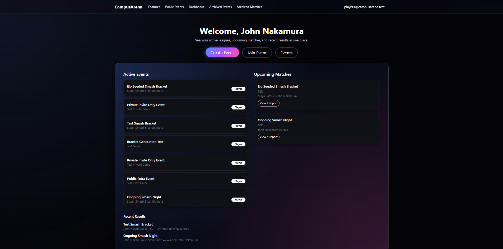

[CampusArena GitHub Organization](https://github.com/campusarena)

[Live Demo on Vercel](https://campusarena.vercel.app/) (can log in with player1@campusarena.test / password123)

CampusArena is a team built web app designed to help students organize, compete, and connect through leagues and tournaments for both sports and esports. The main goal was to make a single place where someone can create an event, invite or accept participants, and then actually run the competition without needing separate tools for brackets, standings, and match results.

A big part of the project was building the full flow from “I have an idea for a tournament” to “we have a completed bracket and archived results.” Events can be public or private, and the app supports browsing upcoming public events so students can discover what is happening and join. Once an event is created, organizers can manage the participant list, set things up for bracket play, and keep the competition moving by recording match outcomes. On the user side, the dashboard experience keeps things organized by showing what you are involved in, while archived events and archived matches make it easy to look back at past results.

This project also pushed me to treat UI and data consistency as a real engineering problem. It is not enough to make one page look good. Pages have to match each other, navigation has to stay consistent, and common UI patterns need to behave the same way everywhere. We spent time making sure the site felt cohesive, with reusable components and predictable layouts, so users do not have to relearn the interface every time they click to a new page.

On the engineering process side, CampusArena was where I got the most practice working like a real development team. We relied on GitHub issues to break down features into small, testable chunks with clear definitions of done. We used branching to keep work isolated, and pull requests to review changes before merging. That review step mattered a lot because it caught bugs early, kept the codebase cleaner, and forced us to explain our decisions in a way the rest of the team could understand. When something broke, we could usually trace it back quickly because commits and issues created a clear history of what changed.

Deployment on Vercel made the project feel more “real” too, because it removed the excuse of “it runs locally.” Once the app is deployed, you immediately notice the importance of stable configuration, environment variables, build reliability, and keeping the main branch in a working state. It also made it easy to share the project with other people for feedback, which is something you cannot really do with a local only class project.

Overall, CampusArena was the best example in this class of what software engineering means beyond web development. The tech stack mattered, but the bigger lessons were about collaboration, project organization, managing change, and building something that a user can actually navigate and trust.

