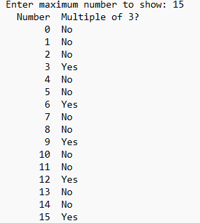

Overview - 
This project involved creating a cross-language program where Java handled user interaction and display while C performed backend computations. The program generated a formatted table of numbers, using a C function to determine whether each number was a multiple of three. This exercise focused on bridging high-level language convenience with low-level performance, allowing me to use the best tool for each part of the task.

Implementation -
Using the Java Native Interface (JNI), I connected Java methods to C functions and compiled them into a shared library. The front end displayed a neatly formatted table of numbers and relied on native calls to determine if a number was a multiple of three, returning results as 1 or 0. The project also included a Makefile to compile both the Java and C components, ensuring smooth integration across languages and platforms.

Outcome -
This project helped me understand how different languages can work together to build a single cohesive application. I gained experience in JNI setup, cross-language function calls, and debugging across multiple environments. It also reinforced the importance of modular design and clear interfaces between system components

## Example Code: User Interface Function

```c
int user_interface()
{
    int max;
    int user_input = 0;
    char trash[100];

    printf("This program will generate a table of numbers from\n"
           "0 to the maximum number you (the user) provide(s)\n"
           "It will also have a column stating whether each\n"
           "number is a multiple of 3 or not.\n");

    printf("Enter maximum number to show: ");

    user_input = scanf("%d", &max);

    if (user_input != 1 || max <= 0)
    {
        printf("Please enter a valid positive integer.\n");
        fgets(trash, 100, stdin);
        max = -1;
    }
    return max;
}
```
