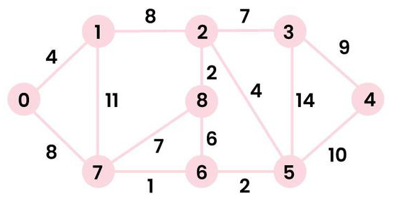

    


Overview -
Throughout my coursework, I implemented a variety of algorithms and data structures in both Java and C++. These implementations included linked lists, heaps, sorting algorithms, graph traversals (BFS/DFS), shortest path algorithms such as Dijkstra’s and Bellman-Ford, and several dynamic programming problems. This project represents a collection of these implementations and the analysis I performed to understand their efficiency and correctness.

Implementation -
Each algorithm was implemented following CLRS-style pseudocode, then tested on sample input to verify correctness. I performed runtime analysis to confirm that the implementations met their expected time complexities, such as O(V log V + E) for Dijkstra’s algorithm with a priority queue. I also created a personal cheat sheet summarizing the pseudocode, runtimes, and problem-solving patterns for use during exam prep.

Outcome -
This work strengthened my algorithmic problem-solving skills and deepened my understanding of runtime analysis. By translating theoretical designs into code, I learned to identify edge cases, validate outputs, and optimize for performance. These skills continue to be foundational for tackling new technical challenges.

Here is an example of some psuedocde I had to learn how to implement to solve a shortest paths problem

Here is an example of some pseudocode I had to learn and implement to solve a shortest paths problem:

```text
DIJKSTRA(G, w, s)
  INITIALIZE-SINGLE-SOURCE(G, s)
  S = ∅
  Q = G.V
  while Q ≠ ∅
    u = EXTRACT-MIN(Q)
    S = S ∪ {u}
    for each vertex v in G.Adj[u]
      RELAX(u, v, w)


